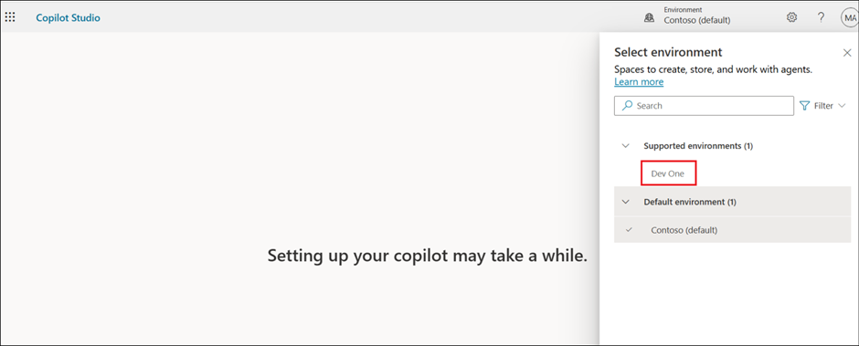
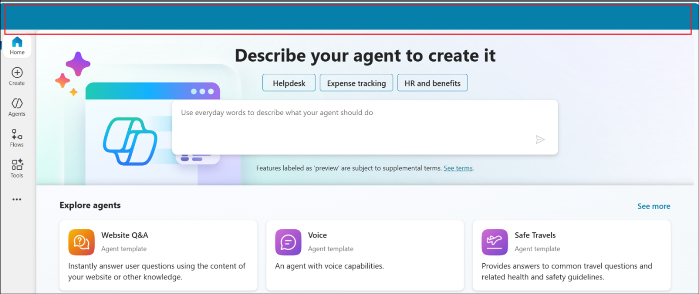
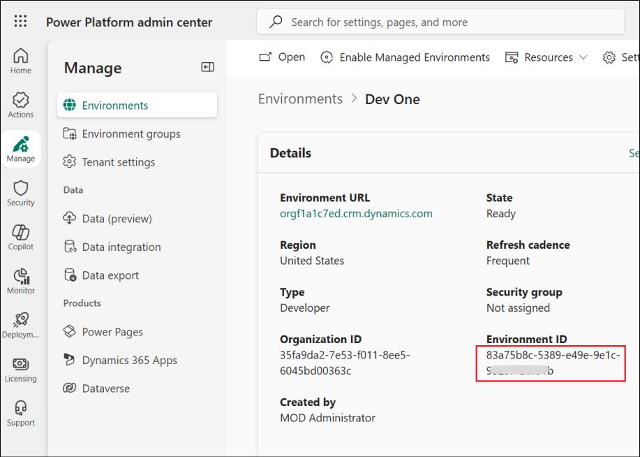
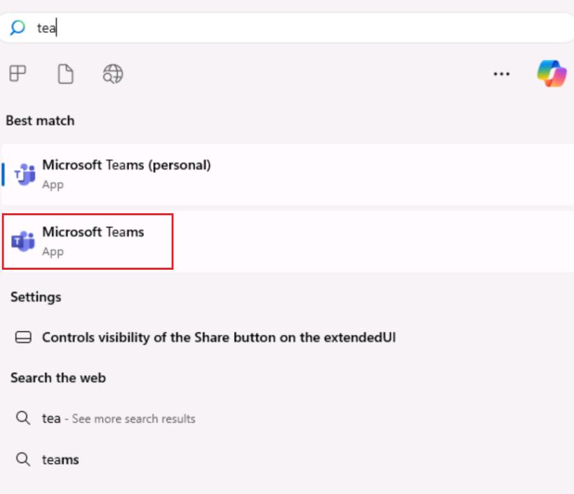
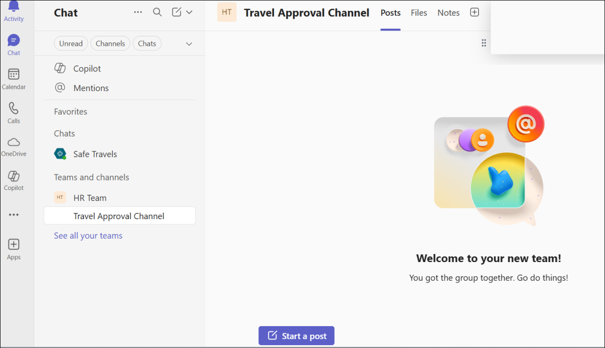

# Lab 1 - Build and enhance a Safe Travels agent and implement Multi agent orchestration

**Objective**

**Agent templates** are designed to help you get started with a **custom
agent**. You are responsible for assessing all safety and legal
implications of using an agent template and customizing it as
appropriate for your business.

An agent built from the **Safe Travels agent template** is a
Business-to-Employee (B2E) agent designed to provide employees of a
company with **travel assistance**. This agent helps ensure employees
are well-prepared and informed for their next work trip. This agent uses
natural language processing to offer a conversational interface, making
it easy and intuitive for employees to access the information they need.
However, the default website used by the agent currently only covers US
travel destinations. You can replace the default website with your own
knowledge source.

You will then understand how that agent can be enhanced to suit the
needs of specific customers.

In the process of doing that, you will learn the concepts of Agent Flow
creation and Multi agent orchestration in Copilot Studio.

## Exercise 1: Create Safe Travels agent from template

In this exercise, you will create the agent in Copilot Studio using the
Safe Travels agent template.

1.  From a browser, login to
    +++[https://copilotstudio.microsoft.com+++](https://copilotstudio.microsoft.com+++/).
    The Start free trial page opens up. Select your country and
    click **Start free trial**.

2.  Select the **Dev One** environment.

> 
>
> \[!Alert\] **Important** If the Copilot Studio and does not show up
> the option to select **Environment** as in the below screenshot, then
> follow the below steps.

> Open +++<https://admin.powerplatform.microsoft.com/+++>.
> Select **Manage**  \> **Environments** and select the value of
> the **EnvironmentID**. 

Navigate back to the Copilot Studio tab and open
+++<https://copilotstudio.microsoft.com/environments/>**\< EnvironmentID
\>**+++ (Replacing **\< EnvironmentID \>** with the value fetched above)

3.  Select **+ Create** from the left pane to create a new agent.

4.  Under **Start with an agent template**, select **Safe Travels**.

5.  The Safe Travels template creates a new agent that is designed to
    provide employees of a company with travel assistance. 

6.  Browse through the set-up page. Under **Knowledge**, you can find
    that **US Travel Website** is already added as a Knowledge source.
    It can be edited if needed. Here, we are using the same website.

7.  Select **Create** to create the Safe Travels agent. We are not
    changing anything here and using the template as such. At any point,
    the agent can be upgraded as per the user requirements.

8.  The **agent** gets **created** and opens up automatically showing up
    the **Overview** page.

9.  In the Test pane, enter +++How to apply for passport?+++ and
    hit **Send**.

The Test pane is open by default. If not, click on the Test icon on top
right.

10. You can see that the agent provides information on how to apply for
    the passport from its knowledge source.

## Exercise 2: Publish the agent to Teams and Microsoft 365 Copilot

In this exercise, you will **publish** the agent created in Copilot
Studio to the **Microsoft Teams** and **Microsoft 365 Copilot** channel.

1.  Open MS Teams from the VM and login using your tenant credentials.

2.  Back in the Copilot Studio, select **Publish** from the top right of
    the agent page.

3.  Select **Publish** in the confirmation dialog.

4.  Select **Channels** from the top navigation bar.

5.  Select **Teams and Microsoft 365 Copilot** from the list of
    available channels.

6.  Select **Add channel**.

7.  Click on the **See agent in Teams** option add the agent to the
    Teams.

8.  This opens up the agent in the Microsoft Teams. Select **Add** to
    add the agent.

9.  Once added, you will get an option to open the agent.
    Select **Open**.

10. Test the agent from Teams.

11. Back in the Copilot Studio, close the Teams and Microsoft 365
    Copilot channel window.

## Exercise 3 – Test the existing Safe Travels agent

In this exercise, we will test the **Safe Travels** agent to see how it
responds when asked about travel approval.

1.  Open the **Copilot Studio** at
    +++[https://copilotstudio.microsoft.com+++](https://copilotstudio.microsoft.com+++/) from
    a browser. Navigate to the **Dev One** environment and open
    the **Safe Travels** agent.

2.  Select the **Test** icon to test the agent.

3.  Enter +++Need travel approval+++ in the Test window and click
    on **Enter**.

4.  You can see that the agent responds with a generalized instruction
    set to be followed to get the travel approval.

## Exercise 4 – Enhance the agent with company specific Knowledge assets

In this exercise, we will add knowledge asset - **Travel
Policy** specific to Contoso.

1.  From the Overview page of the agent, scroll down and select **+ Add
    knowledge**

2.  Click on **select to browse** option.

3.  From **C:\Labfiles\Lab Files** folder, select **Travel
    Policy.docx** and click **Open**.

4.  Click **Add to agent** to the add the file.

5.  Ensure that the file is added. Wait till the status changes
    from **In progress** to **Ready** before proceeding to the next
    step.

> 

## Exercise 5 – Create a Team and Channel in Microsoft Teams

In this exercise, we will create a team and a channel in MS Teams to
which the travel approval request will be sent.

1.  Open Microsoft Teams and select **See all your teams** option from
    the left pane.

2.  Select **Create team** to create a new team.

3.  Enter the Team name as +++**HR Team**+++ and First channel name as
    +++**Travel Approval Channel**+++ and select **Create**.

4.  Select **Skip** in the Add members to HR Team dialog.

5.  Now, the Team and Channel creation is completed.

## Exercise 6 – Create an Agent Flow

In this exercise, we will create a new AgentFlow to post the travel
request to the Teams channel

1.  Select **Flows** from the left pane.

2.  Select **New agent flow** to create a new flow.

3.  Select **Add a trigger**.

4.  Select **When an agent calls the flow** under **AI capabilities**.

5.  Select **+ Add an input**.

6.  Select **Number** and name it as +++**Employee ID**+++. Then
    select **+ Add an input**.

7.  Now, select a **Text** input and name it as +++**Purpose**+++.

8.  Select **Add an action** below the trigger node.

9.  Search for +++**Teams**+++ and click on **See more** under the Teams
    group of actions.

10. Select **Post message in a chat or channel**.

11. Select **Sign in** and **login** using your credentials.

12. Select the below details

> Post as – Select **User**
>
> Post in – Select **Channel**
>
> Team – Select **HR Team**
>
> Channel – Select **Travel Approval Channel**

13. In the Message field, enter the following

> Travel Request from
>
> Employee ID - \<Employee ID\>
>
> Purpose - \<Purpose\>
>
> Replace **\< Employee ID \>** and **\< Purpose \>** with the dynamic
> content variables, **Employee ID** and **Purpose** as in the below
> screenshots.

14. The Parameters tab will now look like below.

15. Close the Parameters tab.

16. Add another **action** after the Post message node.

17. Select **Respond to the agent** under **Skills**.

18. Select **Add an output**. Add a **Text** output. Name it as
    +++Output+++ and enter the value as +++Request submitted+++.

19. Click on **Save draft** to save the flow.

20. Once the flow is saved, select **Publish**.

21. Ensure that the flow has been published.

22. Click on the **Overview** tab of the agent flow.

23. Select **Edit** and name the flow as +++Request Travel Approval
    Flow+++ in the **Details** pane. Select **Save**.

## Exercise 7 – Add the Agent flow as a tool to the agent

In this exercise, we will add the create Agent flow to the agent Safe
Travels in order to leverage the flow functionality.

1.  From the left pane, select **Agents**.

2.  Select the **Safe Travels** agent.

3.  Scroll down in the Overview page and select **Add tool**.

4.  From the **Flow** tab, select the created **Request Travel Approval
    Flow**.

5.  Select **Add to agent**.

6.  Once added, the flow will get listed under **Tools** section of
    the **Overview** page of the **agent**.

## Exercise 8 – Create Topic

In this exercise, we will create a Topic to use the created travel
approval flow.

1.  Select **Topics** from the top menu. Select **+ Add a
    topic** -\> **Add from description with Copilot**.

2.  Enter the below details and then select **Create**.

> **Name** - +++Travel Approval+++
>
> **Create a topic to** - +++This topic should get the Employee ID
> (Number) and Purpose of travel (Text) details from the user and invoke
> the Tool "Request Travel Approval Flow"+++

3.  The **Topic** gets created as below.

4.  See if the Flow is actually invoked. In this case, only a Message
    node stating that the flow is invoked is added. In such a case,
    delete such Message node and click on Add a node icon after the node
    where the Purpose is requested from the user.

5.  Select **Add a tool** -\> **Request Travel Approval Flow**

6.  Add the Variable **EmployeeID** for the flow variable **Employee
    ID.**

7.  Similarly add the Purpose of travel input.

8.  Add a **Send a message** node and add the Output Variable to it as
    in the screenshots below.

9.  Select **Save** and then **Publish** to publish the agent.

10. Select **Publish** in the confirmation dialog box.

11. Select the Test icon and enter +++Travel Approval+++ and send from
    the test pane.

12. Converse by giving the below details to the agent

> Employee ID – +++1234+++
>
> Purpose of travel - +++Client meeting for finalizing proposal of XYZ
> project+++

13. Select **Allow** to allow connection.

14. You will get a **Request submitted** message from the agent.

15. Open the Teams Channel and you will see the details posted there for
    the Travel approval.

## Exercise 9 – Create Leave Management agent

In this exercise, we will build a Leave management agent which can be
used to learn about the leaves, leave balance for employees and so on.

1.  From the Copilot Studio Home page, select **Agents** -\> **+ New
    agent**.

2.  Select the **Configure** tab, enter the below details and
    select **Create**.

    - Name - +++Leave Manager Agent+++

    - Description - +++This agent is to track the leaves of all the
      employees, their leave balance and leave history to approve or
      reject any new leave requests.+++

    - Instructions - +++Track the leaves of employees. Track their leave
      balance. Apply/Reject leaves based on their balance.+++

3.  Once the agent gets created, scroll down in the Overview page and
    select **Add knowledge** under the **Knowledge** section.

4.  Click on **select to browse**.

5.  Select the file **Leave balance Tracker** from **C:\Labfiles\Lab
    Files** and click **Open**.

6.  Select **Add to agent** to add the tracker to the agent.

7.  The file gets added. Wait until the status is Ready before
    proceeding to the next step.

8.  Select **+ Add a topic** -\> **Add from description with
    Copilot** from the Topics tab.

9.  Enter the below details and click on **Create**.

    - Name - +++Leave Balance Checker+++

    - Create a topic to - +++Get the Employee ID from the user and check
      and reply with the leave balance based on the tracker added as
      knowledge source+++

10. Check if the topic has the node to get the Employee ID and then
    click **Save**. Here, we have a node for getting the Employee ID and
    a Message node stating that the balance is being retrieved.

> Check the topic once and remove other nodes that have got created
> apart from the above ones.
>
> Then **Save** the topic.

11. Send a message +++Check Leave balance+++ from the Test pane.

12. Enter +++1234+++ for Employee ID.

13. Check the response from the agent. This is retrieved from the
    knowledge asset added to the agent.

14. Select **Publish** and wait till the agent is published.

## Exercise 10 - Implement Multi agent orchestration in Copilot Studio

Rather than relying on a single agent to do everything—or managing
disconnected agents in silos—organizations can now build multi-agent
systems in Copilot Studio (preview), where agents delegate tasks to one
another. This includes those built with the Microsoft 365 agent builder,
Microsoft Azure AI Agents Service, and Microsoft Fabric. These agents
can now all work together to achieve a shared goal: completing complex,
business-critical tasks that span systems, teams, and workflows.

In this exercise, we will add the Leave management agent to the Safe
Travels agent which can be used to learn about the leaves when planning
to travel.

1.  Select the **Safe Travels** agent from Copilot Studio.

2.  We will first test this agent to see what information it can give on
    leaves. From the Test pane, enter +++Check Leave balance+++ and hit
    enter.

3.  You can see that the agent responds with a generalized information
    on how to check the leave balance. It also refers to the Travel
    Policy document while doing this.

4.  Select the **Agents** tab from the top menu and select **+ Add**.

5.  Under **Choose how do you want to extend your agent**,
    select **Copilot Studio**.

6.  From the list, select **Leave Manager Agent**. It can be added only
    if it is published. Please wait if it is in the process of
    publishing.

7.  Select **Add agent** to add this agent to **Safe Travels**.

8.  Wait for few minutes after the agent is added and then click
    on **Publish**.

9.  Wait for few more minutes after the agent is published and then
    enter +++Check Leave balance+++ in the Test pane of the **Safe
    Travels agent**.

10. You can see that the **Leave Manager** agent is accessed
    automatically and the agent replies with the **Enter Employee
    ID** question from the **Leave Manager agent’s topic**.

11. Enter the Employee ID as +++1234+++ and you can see that the agent
    replies based on the Leave Manager agent’s knowledge asset.

**Summary**

In this lab, we have learnt how to create an agent from a template and
enhance it to suit the individual needs. We have also learnt to
implement Multi agent orchestration in the Copilot Studio.
