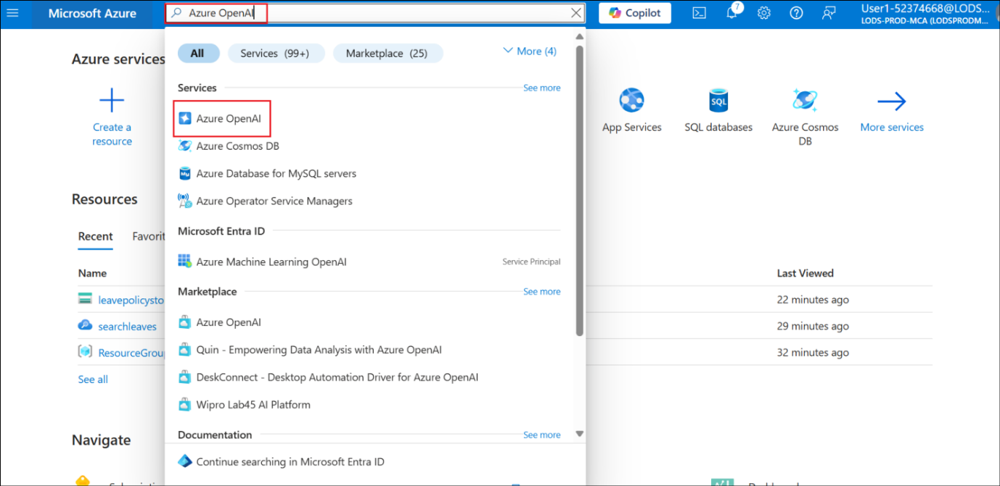
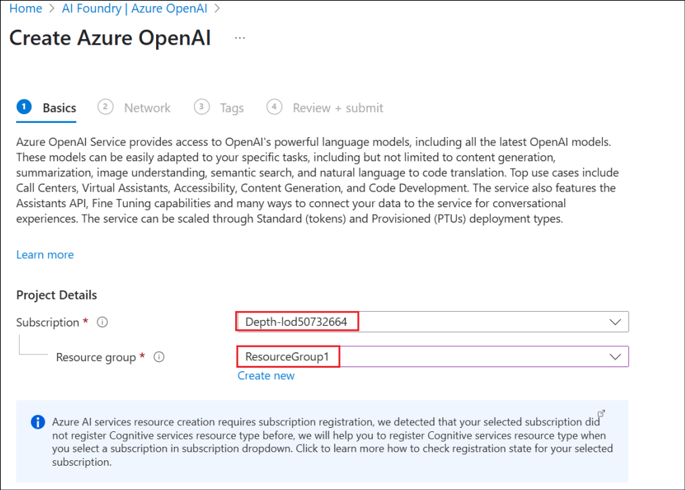
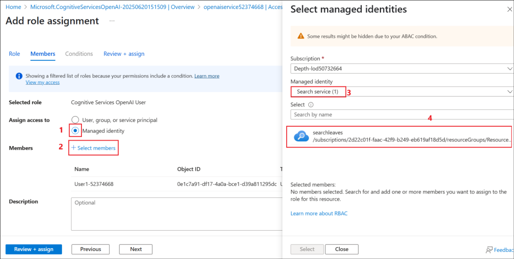
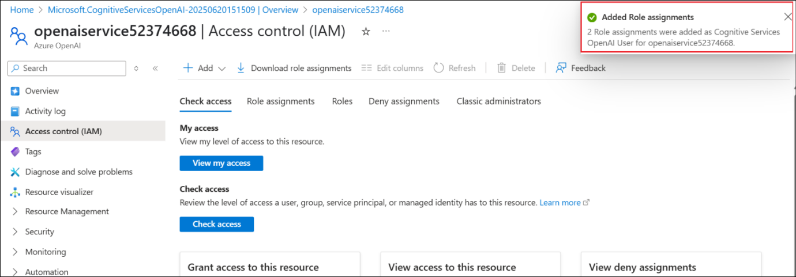
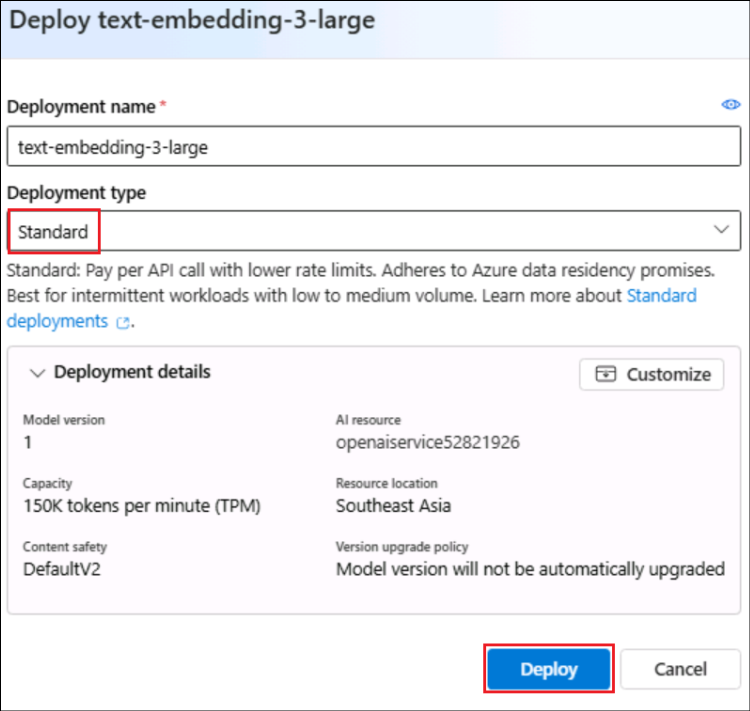
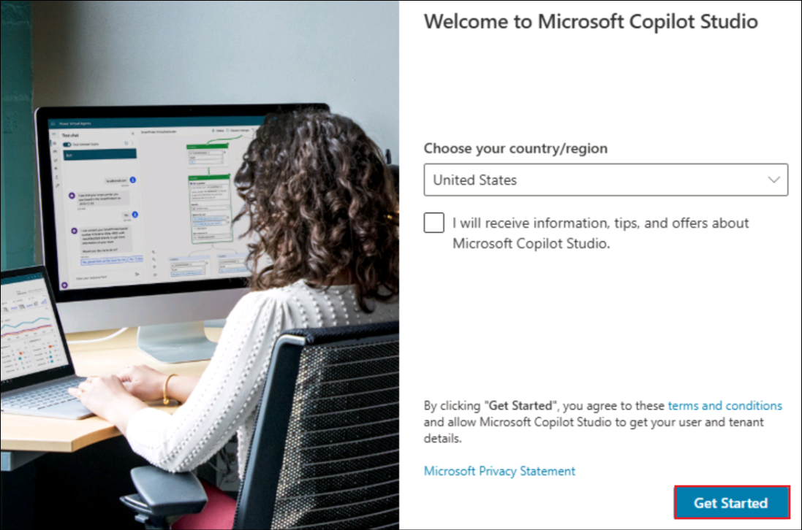
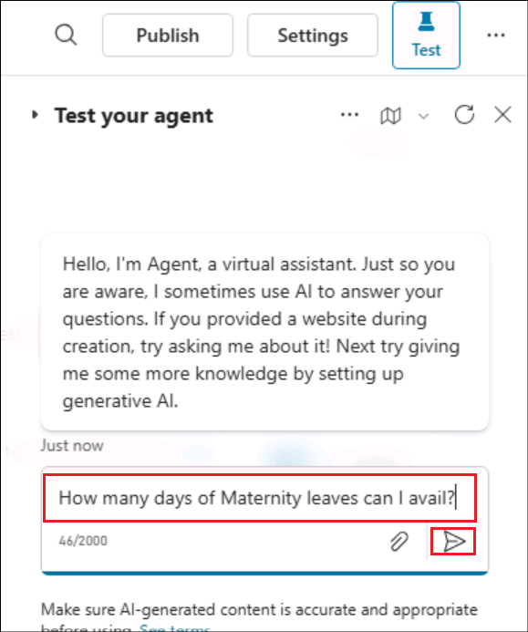
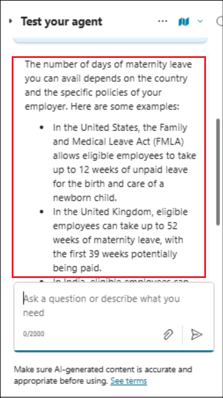
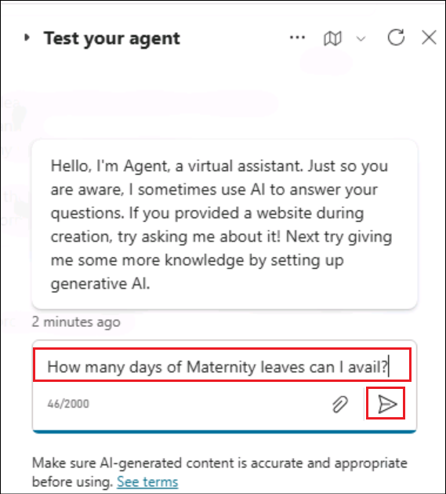
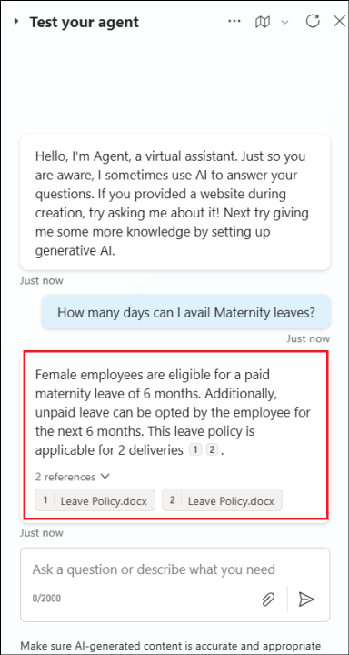

# Lab 2 - Create a Knowledge Assistant agent for HR in Copilot Studio that leverages Azure AI Search

**Objective:**

A large enterprise wants to reduce the time employees spend searching
for HR-related information (policies, benefits, leave guidelines, etc.)
spread across SharePoint, PDFs, internal wikis, and documents.

To overcome this issue, in this lab, you will build a **Knowledge
assistant** **agent** in **Copilot Studio** that uses **Azure AI
Search**, to index and semantically search across enterprise HR
documents.

## Exercise 1: Create an Azure AI Search resource

In this exercise, you will create an Azure AI Search resource from the
Azure portal. This will be used to search the documents using AI
capability.

**Azure AI Search** is a cloud-based service for searching within your
privately curated data. It uses a combination of Microsoft’s AI and
JSON-based indexes to provide fast, relevant search results.

1.  Open a browser and login to Azure portal at
    +++<https://portal.azure.com/+++> with your credentials.

    - Username - <+++@lab.CloudPortalCredential>(User1).Username+++

    - Password - <+++@lab.CloudPortalCredential>(User1).Password+++

    From the Home page of the Azure portal, select **Azure AI Foundry.**

    

2.  In the **AI Foundry page**, select **AI Search** under **Use with AI
    Foundry** from the left pane and then select **+ Create**.

    

3.  Enter the below details and select **Review + create**.

    - Subscription – Select your **assigned subscription**

    - Resource group – Select your **assigned Resource
      group** (**ResourceGroup1**)

    - Storage account name –
      +++[**searchleaves@lab.LabInstance.Id**](mailto:searchleaves@lab.LabInstance.Id)+++

    - Location – Select @lab.CloudResourceGroup(ResourceGroup1).Location

    

4.  Once the validation passes, select **Create**.

    

5.  The deployment takes around 10 minutes to complete. Select **Go to
    resource** once the search service is created.

    

6.  From the **Overview** page, copy the **Url** value and save it in a
    notepad to be used in a future exercise.

    

7.  Select **Keys** under **Settings** from the left pane. Copy
    the **Primary admin key** and save it in a notepad for using it in
    the upcoming exercises.

    

8.  Select **Identity** under **Settings** from the left pane.

    

9.  Toggle the Status to **On** under **System assigned** and then click
    on **Save**.

    

10. Select **Yes** in the **Enable system assigned managed
    identity** confirmation dialog.

    

## Exercise 2: Create a Storage account

1.  From the Azure portal Home page (+++<https://portal.azure.com/+++>),
    select **Storage accounts**.

    

2.  Select **+ Create** to create a new Storage account.

    

3.  Enter the below details, accept the default values in the other
    fields and click on **Review + create**.

    - Subscription – Select your **assigned subscription**

    - Resource group – Select your **assigned Resource
      group** (**ResourceGroup1**)

    - Storage account name –
      +++[**leavepolicystg@lab.LabInstance.Id**](mailto:leavepolicystg@lab.LabInstance.Id)+++

    - Region – Select @lab.CloudResourceGroup(ResourceGroup1).Location

    - Primary service – Select **Azure Blob Storage or Azure Data Lake
      Storage Gen 2**

    

4.  Once the validation passes, click on **Create**.

    

5.  Once the resource creation succeeds, click on **Go to resource**.

    

    

6.  Select **Containers** under **Data storage**. Select **+
    Container**, enter the name as +++**document**+++ and click
    on **Create** to create the container.

    

7.  Select the created container **document** to upload the leave policy
    document into it.

    

8.  Click on **Upload** and then select **Browse for files**.

    

9.  Select the **LeavePolicy.docx** from **C:\Labfiles\LabFiles** and
    then click on **Upload**.

    

    

10. Navigate to the +++**leavepolicystg@lab.LabInstance.Id**+++ Storage account (Select **Storageaccounts** from the **Home
    page** of the Azure portal and select **leavepolicystg@lab.LabInstance.Id**) and select **Access Control (IAM)** from the left pane. Select **Add -> Add role assignment**.

    

11. Search for +++**Storage Blob Data Reader**+++, select it and click on **Next**.

    

12. Click on **+Select members**, search for and select your **user
    name**, <+++@lab.CloudPortalCredential>(User1).Username+++ and then
    click on **Select**. This adds the Storage Blob Data Reader role to
    your user id.

    

13. Select **Managed identity** and then select **+ Select members**.
    Select **Search service** under **Managed identity** and select
    the **searchleaves** search service that gets listed.

    

14. Click on **Select** to select the search service.

    

15. Back in the Add role assignment screen, click on **Review +
    assign**.

    

16. Select **Review + assign** again in the next screen.

    

17. Proceed to the next step once the roles are added.

    

In this exercise, we have created a Storage account and added the
document and required Role permissions to it.

## Exercise 3: Create an Azure OpenAI Service and deploy a model

1.  From the Azure portal Home page, search for and select +++Azure
    OpenAI+++.

    

2.  Select **+ Create**.

    

3.  Enter the below details and select **Next**.

    - Subscription – Select your **assigned subscription**

    - Resource group – Select your **assigned Resource
      group** (**ResourceGroup1**)

    - Region – Select @lab.CloudResourceGroup(ResourceGroup1).Location

    - Name –
      +++[**openaiservice@lab.LabInstance.Id**](mailto:openaiservice@lab.LabInstance.Id)+++

    - Pricing tier – Select **Standard S0**

    

    

4.  Select **Next** in the next 2 screens select **Create** in
    the **Review + submit** screen.

    

5.  Click on **Go to resource** once the service is created.

    

6.  Select **Access control (IAM)** from the left pane, select **Add -\>
    Add role assignment**.

    

7.  Search for +++**Cognitive Services OpenAI User**+++, select the role
    and click on **Next**.

    

8.  Select **+ Select members**, search for your **user
    name**, <+++@lab.CloudPortalCredential>(User1).Username+++, select
    it and click on **Select**.

    

9.  Back in the **Add role assignment** screen, select **Managed
    identity**. Then select **+ Select members**. In the **Select
    managed identities** screen, select **Search
    service** under **Managed identity** and select
    the **seachleaves** service.

    

10. Once selected, click on **Select**.

    

11. Select **Review + assign** in the next 2 screens.

    

12. Wait for a **success** message on the role additions before
    proceeding with the next tasks.

    

13. From the **Overview** page of the Azure OpenAI Service resource,
    select **Go to Azure AI Foundry portal** to open the Azure OpenAI
    Service there and deploy a model.

    

14. Select **Deployments** from the left pane.

    

15. Select **+ Deploy model** -\> **Deploy base model**.

    

16. Search for +++**text-embedding**+++,
    select **text-embedding-3-large** and then select **Confirm**.

    

17. Select **Deployment type** as **Standard** and then
    select **Deploy** in the **Deploy text-embedding-3-large** screen..

    

18. The model gets deployed and the screen is loaded with the deployment
    details.

    

## Exercise 4: Create a vector index

1.  Back in the Azure portal, open the **searchleaves** AI Search
    service resource.

    

2.  Select **Import and vectorize data**.

    

3.  Select the **Azure Blob Storage** option.

    

4.  Select the **RAG** option in the **What scenarios are you
    targeting?** screen.

    

5.  Enter the below details, accept the other values as default and
    click **Next**.

    - Subscription – Select your **assigned subscription**

    - Storage account-
      Select [**leavepolicystg@lab.LabInstance.Id**](mailto:leavepolicystg@lab.LabInstance.Id)

    - Blob-container – Select **document**

    

6.  In the Vectorize your text screen, the subscription is
    pre-populated. Enter the below details and click **Next**.

    - Azure OpenAI Service –
      Select [**openaiservice@lab.LabInstance.Id**](mailto:openaiservice@lab.LabInstance.Id)

    - Model deployment – Select **text-embedding-3-large**

    - Authentication type – Select **System assigned identity**

    - Select the checkbox to acknowledge the cost alert of Azure OpenAI.

7.  Select Next in the **Vectorize and enrich your images** screen since
    we are not dealing with images here and select **Next** in
    the **Advanced settings** screen as well.

    
    
    

8.  Select **Create** in the **Review + create** screen.

    

9.  Click on **Close** in the success dialog box.

## Exercise 5: Create a knowledge assistant agent

1.  Open a new broser and login to
    +++[https://copilotstudio.microsoft.com+++](https://copilotstudio.microsoft.com+++/) using
    your login credentials.

2.  Select **Get Started** in the Welcome to Microsoft Copilot Studio.

    

    

3.  The agent creation page gets opened. Describe the agent in
    the **Describe** tab. Enter +++You are a Knowledge assistant agent
    for HR who will answer questions related to leaves and leave
    policies to the employees.+++ and select **Send**.

    

4.  The copilot suggests a name to the agent. Click on **Create** to
    create the agent.

    

    

5.  Once the agent is created, in the Test pane, enter +++How many days
    of Maternity leaves can I avail?+++ and click **Send.**

    

6.  It gives a generalized reply as in the screenshot below.

    

## Exercise 6: Add the Azure AI Search as a knowledge source

1.  From the **Overview** page of the agent, select **Add knowledge**.

    

2.  Select Azure AI Search from the list of knowledge sources available.

    

3.  Click on the **drop down** next to **Not connected** in the next
    screen and select **Create new connection**.

    

4.  Enter the **Endpoint url** and the **Admin key** values which we
    saved to a notepad in a previous exercise and then click
    on **Create** to create the connection.

    

5.  Once the connection is established, the available index is listed
    and already selected. Click on **Add to agent**.

    

6.  The AI Search service is added as a knowledge source to the agent
    and is in **Ready** state now. Ensure that the **Web search** option
    is **disabled** in the Knowledge section.

    

7.  Now, let us test the agent with the same question we tried before.

8.  In the Test pane, enter +++How many days of Maternity leaves can I
    avail?+++ and click **Send.**

    

9.  You can see that the response from the agent now is from the
    document uploaded in the AI Search service.

    

**Summary:**

In this lab, we have learnt to connect the agent to a Azure AI Search
service as a knowledge source and test the agent based on the source.

 

